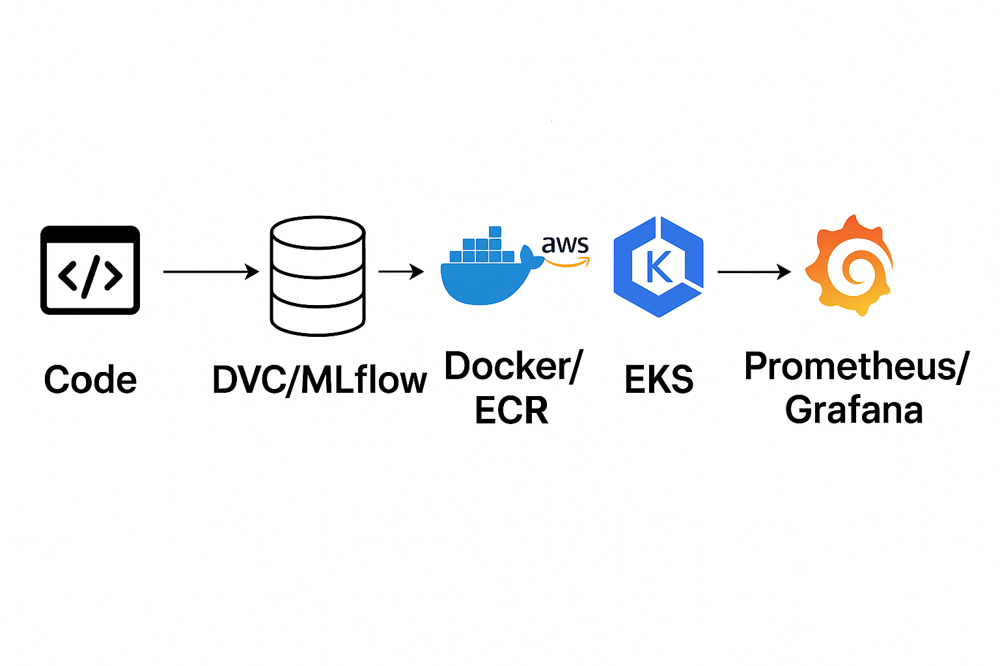

Absolutely 👍 Here’s the **complete, updated, and ready-to-copy README** — with all **screenshot links changed to local relative paths** (so you’ll never hit the “429: Too Many Requests” error again).

Make sure all your screenshots (like `MLOps_Architecture.png`, `ecr.png`, etc.) are inside a folder named `screenshots/` in your project root.

---

```markdown
# End-to-End MLOps Pipeline – Sentiment Analysis Project  
**Production-Ready Deployment on AWS EKS with Monitoring & Alerting**

This project demonstrates a **complete MLOps lifecycle** — from data ingestion to model deployment and monitoring — built around a **Sentiment Analysis model**.  
It integrates **DVC, MLflow, Docker, AWS ECR/EKS, Prometheus, Grafana, and GitHub Actions**, creating a real-world **CI/CD-enabled MLOps system**.

---

## 🚀 Project Overview

This pipeline automates:

- **Data → Model → Deployment → Monitoring**
- Continuous integration (CI) with **GitHub Actions**
- Continuous delivery (CD) to **AWS EKS**
- Real-time monitoring via **Prometheus & Grafana**

### 🎯 Key Goals
- Reproducible ML workflow using **DVC & MLflow**  
- Model versioning and automatic promotion via **MLflow Registry**  
- Seamless containerization and deployment on **AWS EKS**  
- Scalable model monitoring with **Prometheus + Grafana Alerts**

---

## 🧰 Tech Stack

| Category | Tools / Frameworks |
|-----------|--------------------|
| **Language** | Python 3.11 |
| **Modeling** | Scikit-learn, NLTK |
| **Experiment Tracking** | MLflow + DagsHub |
| **Data Versioning** | DVC |
| **Deployment** | Flask, Gunicorn, Docker, AWS ECR + EKS |
| **CI/CD** | GitHub Actions |
| **Monitoring & Alerting** | Prometheus, Grafana |
| **Cloud Infra** | AWS (ECR, EKS, IAM, CloudFormation) |

---

## 🏗️ Architecture Overview

```

```
    ┌──────────────────────┐
    │      Developer       │
    │   (Push to GitHub)   │
    └──────────┬───────────┘
               │
               ▼
     ┌───────────────────┐
     │ GitHub Actions CI │───► Runs DVC + MLflow + Tests
     └──────────┬────────┘
                ▼
     ┌───────────────────┐
     │ Docker Build +    │
     │ Push to AWS ECR   │
     └──────────┬────────┘
                ▼
     ┌───────────────────┐
     │ Deploy on EKS     │
     │ via kubectl apply │
     └──────────┬────────┘
                ▼
     ┌───────────────────┐
     │ Prometheus &      │
     │ Grafana Monitor   │
     └───────────────────┘
```

````

---

## ⚙️ CI/CD Pipeline (GitHub Actions)

Automated workflow from training to deployment:

1. Run DVC pipeline & unit tests  
2. Promote best model to MLflow Production  
3. Build & push Docker image to AWS ECR  
4. Update EKS cluster via `kubectl`

```yaml
on: push
jobs:
  project-testing:
    runs-on: ubuntu-latest
    steps:
      - uses: actions/checkout@v3
      - name: Install & Test
        run: |
          pip install -r requirements.txt
          dvc repro
          python -m unittest tests/test_model.py
      - name: Build & Push Docker
        run: |
          docker build -t capstone-proj .
          docker push <ECR_REPO_URL>
      - name: Deploy on EKS
        run: kubectl apply -f deployment.yaml
````

**Result:**
On every Git push, your app gets retrained, tested, re-deployed, and monitored automatically.

---

## 🐳 Containerization

**Dockerfile Summary:**

* Uses `python:3.11-slim`
* Installs dependencies + NLTK data
* Runs Flask API via **Gunicorn** for production

```dockerfile
CMD ["gunicorn", "--bind", "0.0.0.0:5000", "--timeout", "120", "app:app"]
```

---

## ☁️ Deployment on AWS EKS

**Deployment Highlights:**

* 2 replicas for high availability
* Resource limits ensure efficient scaling
* Secure ECR pull via `imagePullSecrets`
* Secrets managed with Kubernetes Secret
* LoadBalancer exposes API externally on port 5000

```bash
kubectl apply -f deployment.yaml
kubectl get svc
```

---

## 📊 Monitoring & Alerting (Prometheus + Grafana)

**Custom Metrics exposed via Flask app:**

| Metric                        | Description                     |
| ----------------------------- | ------------------------------- |
| `app_request_count`           | Number of API requests          |
| `app_request_latency_seconds` | Request latency per endpoint    |
| `model_prediction_count`      | Predictions per sentiment class |

**Prometheus Scrapes Endpoint:**

```
http://<pod-ip>:5000/metrics
```

**Grafana Dashboards:**
Visualize metrics like request load, latency, and model prediction frequency.

---

## 🖼️ Screenshots

### 🔹 MLOps Project Architecture

<div align="center">
  
  <br/>
  <em>End-to-end MLOps architecture showing data flow from ingestion to monitoring.</em>
</div>

---

### 🔹 ECR Image Repository

<div align="center">
  
  <br/>
  <em>✅ Container image successfully pushed to Amazon Elastic Container Registry (ECR).</em>
</div>

---

### 🔹 EKS Deployment (kubectl output)

<div align="center">
  
  <br/>
  <em>🚀 Flask app deployed on AWS EKS cluster using LoadBalancer service.</em>
</div>

---

### 🔹 Prometheus Metrics

<div align="center">
  
  <br/>
  <em>📈 Prometheus scraping real-time metrics from Flask app endpoint.</em>
</div>

---

### 🔹 Grafana Dashboard

<div align="center">
  
  <br/>
  <em>📊 Grafana dashboard showing live API and model monitoring charts.</em>
</div>

---

## 🔑 Key Highlights

✔ Fully modular DVC pipeline
✔ MLflow + DAGsHub tracking
✔ Automated model registry and promotion
✔ Flask + Gunicorn deployment
✔ Kubernetes orchestration
✔ Prometheus + Grafana monitoring
✔ Auto-generated developer documentation
✔ Production-grade structure with Makefile & CI-ready setup

---

```

---

✅ **How to use it:**
1. Put this markdown in your `README.md` file.  
2. Create a folder `screenshots/` inside your project root.  
3. Move all image files (like `MLOps_Architecture.png`, `ecr.png`, etc.) into that folder.  
4. Commit and push — your README will now render images **without any 429 errors**.  

---

Would you like me to make a **“GitHub-optimized” version** (with badges, quick links, and a professional top section like a portfolio README)?  
It looks great for recruiters and portfolio viewers.
```
