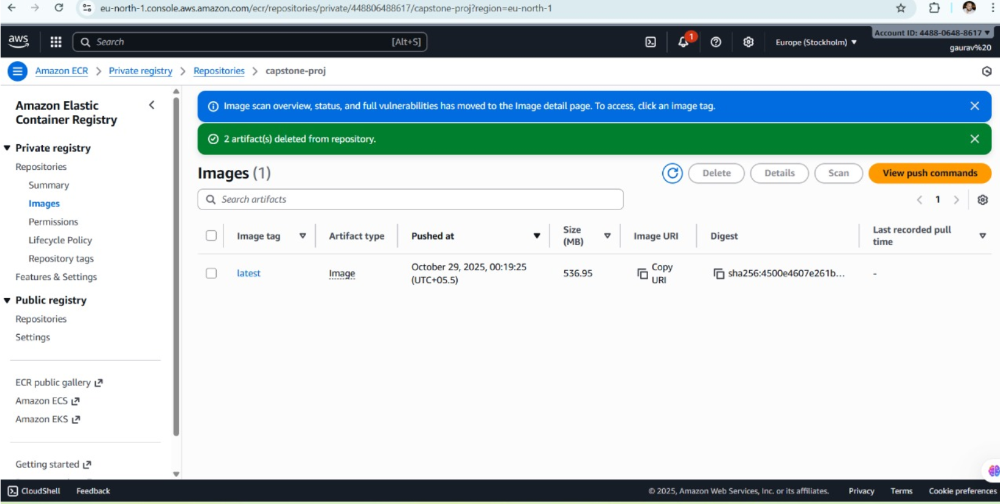
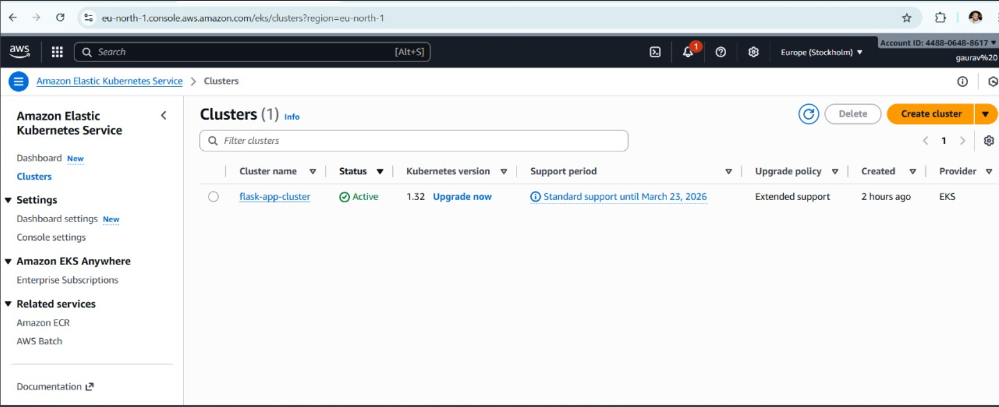
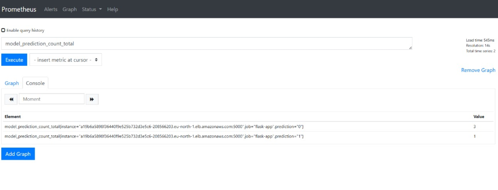
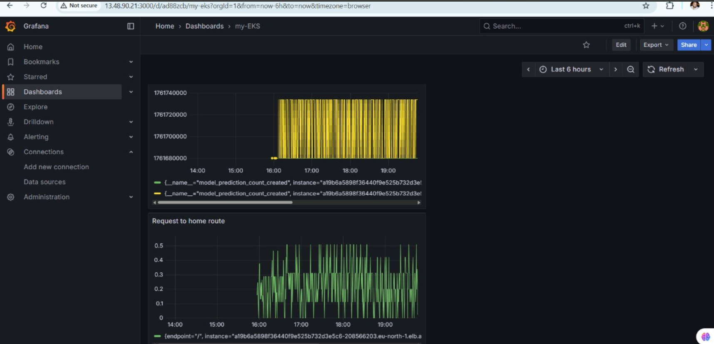

---

# End-to-End MLOps Pipeline – Sentiment Analysis Project

**Production-Ready Deployment on AWS EKS with Monitoring & Alerting**

This project demonstrates a **complete MLOps lifecycle** — from data ingestion to model deployment and monitoring — built around a **Sentiment Analysis model**.
It integrates **DVC**, **MLflow**, **Docker**, **AWS ECR/EKS**, **Prometheus**, **Grafana**, and **GitHub Actions**, creating a real-world **CI/CD-enabled MLOps system**.

---

## Project Overview

This pipeline automates:

* **Data → Model → Deployment → Monitoring**
* Continuous integration (CI) with **GitHub Actions**
* Continuous delivery (CD) to **AWS EKS**
* Real-time monitoring via **Prometheus & Grafana**

###  Key Goals

 Reproducible ML workflow using **DVC & MLflow**
 Model versioning and automatic promotion via **MLflow Registry**
 Seamless containerization and deployment on **AWS EKS**
 Scalable model monitoring with **Prometheus + Grafana Alerts**

---

## ⚙️ Tech Stack

| Category                  | Tools / Frameworks                     |
| ------------------------- | -------------------------------------- |
| **Language**              | Python 3.11                            |
| **Modeling**              | Scikit-learn, NLTK                     |
| **Experiment Tracking**   | MLflow + DagsHub                       |
| **Data Versioning**       | DVC                                    |
| **Deployment**            | Flask, Gunicorn, Docker, AWS ECR + EKS |
| **CI/CD**                 | GitHub Actions                         |
| **Monitoring & Alerting** | Prometheus, Grafana                    |
| **Cloud Infra**           | AWS (ECR, EKS, IAM, CloudFormation)    |

---

##  Architecture Overview

```text
        ┌──────────────────────┐
        │      Developer       │
        │   (Push to GitHub)   │
        └──────────┬───────────┘
                   │
                   ▼
         ┌───────────────────┐
         │ GitHub Actions CI │───► Runs DVC + MLflow + Tests
         └──────────┬────────┘
                    ▼
         ┌───────────────────┐
         │ Docker Build +    │
         │ Push to AWS ECR   │
         └──────────┬────────┘
                    ▼
         ┌───────────────────┐
         │ Deploy on EKS     │
         │ via kubectl apply │
         └──────────┬────────┘
                    ▼
         ┌───────────────────┐
         │ Prometheus &      │
         │ Grafana Monitor   │
         └───────────────────┘
```

---

##  CI/CD Pipeline (GitHub Actions)

Automated workflow from training to deployment:

1. **Run DVC pipeline & unit tests**
2. **Promote best model to MLflow Production**
3. **Build & push Docker image to AWS ECR**
4. **Update EKS cluster via kubectl**

```yaml
on: push
jobs:
  project-testing:
    runs-on: ubuntu-latest
    steps:
      - uses: actions/checkout@v3
      - name: Install & Test
        run: |
          pip install -r requirements.txt
          dvc repro
          python -m unittest tests/test_model.py
      - name: Build & Push Docker
        run: |
          docker build -t capstone-proj .
          docker push <ECR_REPO_URL>
      - name: Deploy on EKS
        run: kubectl apply -f deployment.yaml
```

 **Result:** On every Git push, your app gets retrained, tested, re-deployed, and monitored automatically.

---

##  Containerization

**Dockerfile Summary:**

* Uses `python:3.11-slim`
* Installs dependencies + NLTK data
* Runs Flask API via **Gunicorn** for production

```dockerfile
CMD ["gunicorn", "--bind", "0.0.0.0:5000", "--timeout", "120", "app:app"]
```

---

##  Deployment on AWS EKS

**Deployment Highlights:**

* `flask-app` with 2 replicas for high availability
* Resource limits ensure efficient scaling
* Secrets managed securely via `capstone-secret`
* Exposed using a **LoadBalancer Service (port 5000)**

```yaml
apiVersion: v1
kind: Service
metadata:
  name: flask-app-service
spec:
  type: LoadBalancer
  ports:
    - port: 5000
      targetPort: 5000
```

 Deployed using:

```bash
kubectl apply -f deployment.yaml
kubectl get svc
```

---

##  Monitoring & Alerting (Prometheus + Grafana)

**Custom Metrics exposed via Flask app:**

| Metric                        | Description                     |
| ----------------------------- | ------------------------------- |
| `app_request_count`           | Number of API requests          |
| `app_request_latency_seconds` | Request latency per endpoint    |
| `model_prediction_count`      | Predictions per sentiment class |

**Prometheus Scrapes Endpoint:**

```
http://<pod-ip>:5000/metrics
```

**Grafana Dashboards:**
Visualize metrics like request load, latency, and model prediction frequency.

---

##  Screenshots

### 🔹 ECR Image Repository

Docker images stored securely in AWS ECR


### 🔹 EKS Deployment (kubectl output)

Application successfully deployed on AWS EKS via LoadBalancer


### 🔹 Prometheus Metrics

Live metrics being scraped from `/metrics` endpoint


### 🔹 Grafana Dashboard

Real-time visualization of API requests and model metrics


---

##  Key Highlights

✔️ End-to-End reproducible MLOps workflow
✔️ Automated CI/CD with GitHub Actions
✔️ Scalable deployment on AWS EKS
✔️ Real-time monitoring with Prometheus + Grafana
✔️ Secure model registry via MLflow + DagsHub
✔️ Lightweight, modular, and production-grade architecture

---


##  Author

**Gaurav Kumar**
AI & MLOps Engineer | GenAI, LLMs, Agentic AI
[GitHub](https://github.com/Gaurav9693089415) • [LinkedIn](#)

---
